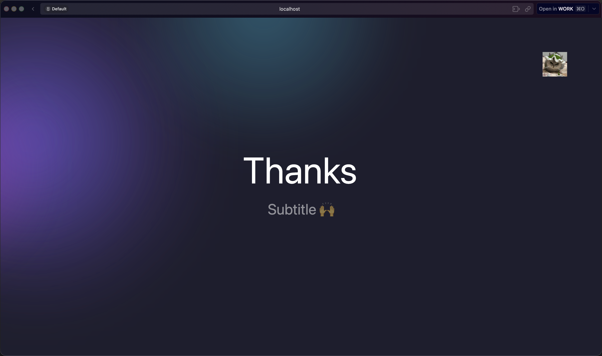

# slidev-theme-penjj

[](https://www.npmjs.com/package/slidev-theme-penjj)
[](https://opensource.org/licenses/MIT)

A modern Slidev theme featuring flowing dynamic aurora backgrounds, designed for AI talks, tech presentations, and developer conferences.



## Features

-  **8+ Stunning Transitions** - Cinematic slide transitions with 3D effects
-  **Aurora Dynamic Background** - Animated flowing gradient orbs for immersive visuals
-  **Tech-Optimized Layouts** - Purpose-built layouts for code demos, architecture diagrams, and product showcases
-  **AI Presentation Ready** - Perfect for LLM talks, ML model explanations, and research presentations
-  **Developer-Friendly** - Beautiful code highlighting, tables, and styled lists
-  **Dark Mode First** - Optimized for dark environments like conference halls

## Installation

```bash
npm install slidev-theme-penjj
```

Or use directly in your Slidev presentation:

```yaml
---
theme: penjj
---
```

## Use Cases

This theme is particularly well-suited for:

- **AI & Machine Learning Talks** - Showcase neural networks, LLM architectures, and research findings
- **Developer Conferences** - Present APIs, frameworks, and technical deep-dives
- **Product Demos** - Highlight tech products with modern, dynamic visuals
- **Startup Pitches** - Impress investors with cutting-edge aesthetics
- **Research Presentations** - Display data and technical content professionally
- **Workshops & Tutorials** - Keep learners engaged with visual variety

## Slide Transitions

Built-in cinematic transitions powered by View Transitions API:

| Transition | Description | Best For |
|-----------|-------------|----------|
| `view-transition` | Smooth cross-fade (default) | General content slides |
| `flip-3d` | 3D flip animation | Revealing new concepts |
| `zoom-focus` | Zoom in with focus effect | Emphasizing key points |
| `slide-over` | Horizontal slide with overlap | Sequential storytelling |
| `rotate-slide` | Rotational entrance | Dynamic topic shifts |
| `cube-right` | 3D cube rotation right | Section transitions |
| `cube-left` | 3D cube rotation left | Returning to previous topics |
| `blinds` | Venetian blinds reveal | Building suspense |

### Usage

```md
---
transition: flip-3d
---

# Transformer Architecture

Watch the page flip to reveal the next concept
```

## Layouts

### Cover

Command attention with an aurora-powered title slide featuring animated gradient orbs.

```md
---
theme: penjj
title: Building LLM Applications
logo: images/logo.png
author: penjj
---

# Building LLM Applications

From Prompt Engineering to Production
```

**Features:**
- Animated aurora background
- Configurable logo (top-right)
- Animated author tagline
- Large typography optimized for readability

### End

Leave a lasting impression with the closing slide.

```md
---
layout: end
---

# Thank You

Questions? Let's discuss!
```

### Two Cols

Perfect for comparing approaches, showing code alongside explanations, or presenting pros/cons.

```md
---
layout: two-cols
---

# Traditional ML vs Deep Learning

Traditional approaches require feature engineering

::right::

# Deep Learning

End-to-end learning from raw data
```

### Section

Clean chapter dividers for organizing your narrative.

```md
---
layout: section
---

# Part 2: Fine-tuning Strategies

Optimizing model performance
```

### Center

Focus attention on a single important message or metric.

```md
---
layout: center
---

# 99.7% Accuracy

Achieved on the benchmark dataset
```

### Card List

Display features, benefits, or roadmap items in an attractive card format.

```md
---
layout: card-list
---

# Model Capabilities

- Code generation across 20+ languages
- Context window up to 128K tokens
- Function calling with JSON output
```

### Two Cols Header

Two-column layout with a shared header - ideal for API comparisons or feature matrices.

```md
---
layout: two-cols-header
---

# API Comparison

::left::
REST API
- Stateless
- HTTP-based
- Wide support

::right::
GraphQL
- Single endpoint
- Flexible queries
- Strong typing
```

## Typography & Components

### Styled Lists

Card-style list items with hover effects and smooth animations:

-  **Hover Animations** - Items lift and gain shadow on hover
-  **Dark Mode Optimized** - Automatic gradient adjustment
-  **Code Highlighting** - Inline code with themed styling

### Data Tables

Professional table styling for presenting benchmarks, comparisons, and metrics:

| Model | Parameters | Context | License |
|-------|------------|---------|---------|
| GPT-4 | 1.76T | 128K | Proprietary |
| Llama 3 | 70B | 8K | Open |

## Advanced Usage

### View Transition Classes

Enable morphing animations for headings:

```md
# Transformer Architecture {.view-transition-title .inline-block}
```

### Custom Transitions Per Section

```md
---
transition: cube-right
layout: section
---

# Training Pipeline

---
transition: zoom-focus
---

# The Attention Mechanism
```

### Frontmatter Configuration

```md
---
theme: penjj
title: My AI Presentation
transition: view-transition
mdc: true
author: Your Name
logo: images/company-logo.svg
---
```

## Development

```bash
# Install dependencies
pnpm install

# Start development server
pnpm dev

# Build for production
pnpm build

# Export to PDF
pnpm export

# Generate screenshots
pnpm screenshot
```

## License

MIT License

